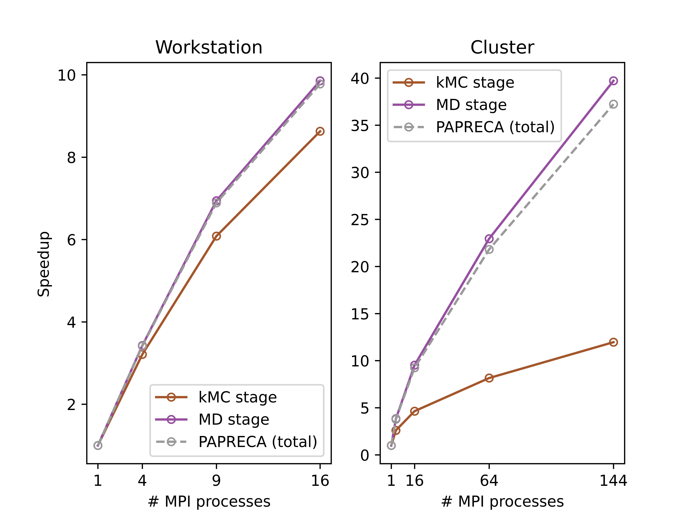

# Summary

Kinetic Monte Carlo (kMC) is an atomistic and stochastic simulation technique that captures the temporal evolution of various systems in materials science, chemistry, physics, biology, and engineering. Several open-source kMC packages are currently distributed online. Nevertheless, such implementations are typically lattice-based and are mostly designed to study ordered, crystalline materials. In this work, we present PArallel PREdefined CAtalog (```PAPRECA```), an easy-to-use and completely lattice-free open-source kMC software suitable for simulations on amorphous materials or systems characterized by a low degree of crystallinity. ```PAPRECA``` is a parallel C++ software using the Message Passing Interface (MPI) protocol and coupled with the Large-scale Atomic/Molecular Massively Parallel Simulator (LAMMPS) [@Thompson2022Feb] to enable pure kMC runs as well as hybrid kMC/Molecular Dynamics (MD) simulations.

# Statement of need

KMC models have been deployed to investigate non-equilibrium dynamics and properties of thin films [@Ntioudis2023Oct], nanoparticles [@Turner2016Apr], quantum dots [@Zhu2007May], semiconductors [@vanderKaap2016Feb], catalysts [@Stamatakis2012Dec], energy-storage devices [@Abbott2022Feb], interstellar grain chemistry [@Cuppen2013Dec], protein folding [@Makarov2001Jun], and enzyme reactions [@Slepoy2008May]. Overall, kMC techniques are, on one hand, less accurate, but on the other hand, more computationally efficient than MD. This is justified by the fact that kMC does not describe atomic vibrations explicitly but evolves the system through discrete elementary processes (e.g., diffusion, deposition, reactions etc.) [@Gillespie1976Dec ; @Fichthorn1991Jul]. In any case, the efficiency of kMC models unlocks the possibility for long-timescale simulations with molecular-level resolution beyond the timescales accessible to MD. Note that efficient MD algorithms can be used to simulate systems with $10^{4}$-$10^{6}$ atoms from ps to $\mu$s [@Thompson2022Feb]).

Typically, on-lattice kMC models select atomistic events from a predefined table and execute them on fixed lattice sites [@Andersen2019Apr]. The use of fixed lattice sites contributes to the computational efficiency of on-lattice algorithms but introduces obstacles associated with the study of unordered materials.
Several lattice-based open-source kMC software are available, examples include the KMCLib [@Leetmaa2014Sep], lattice_mc [@Morgan2017May], KMC_Lattice v2.0 [@Heiber2019Jan], Excimontec v1.0 [@Heiber2020Sep], MonteCoffee [@Jorgensen2018Sep], and KIMERA [@Martin2020Sep]. Additionally, the Stochastic Parallel PARticle Kinetic Simulator (SPPARKS) [@Mitchell2023May] offers solely on-lattice kMC modeling capabilities, since the only currently available off-lattice solver is a Metropolis Monte Carlo relaxation scheme. Furthermore, a wide range of on-lattice kMC packages such as kmcos [@kmcos], PyCD [@PyCD], VIS-A-VIS [@VISAVIS], MulSKIPS [@MulSKIPS], Kimocs [@Kimocs], KSOME [@KSOME], kMCpy [@kMCpy], and Morphokinetics [@Morphokinetics] are available in open-source software repositories.

EON [@Chill2014May] is the only identified off-lattice package distributed under an open-source license. This is an Adaptive kinetic Monte Carlo (AkMC) software that discovers as well as stores atomic-scale processes (e.g., reactions, diffusion) throughout the simulation instead of stochastically selecting transition events from a predefined table [@Henkelman2001Dec]. Such feature elevates the accuracy of AkMC approaches but decreases their computational efficiency as well as increases their implementation complexity compared to predefined table kMC schemes.

To the best of our knowledge, a completely lattice-free kMC code with predefined table of events is currently unavailable in open-source repositories. ```PAPRECA``` aims to fill that gap by providing the scientific community with a general and easy-to-use solution for performing long-timescale atomistic simulations on complex materials science, chemistry, physics, biology, and engineering problems involving amorphous materials or non-crystalline systems.

```PAPRECA``` (in its initial version) is a parallelized software (uses the MPI protocol) that can capture four distinct classes of predefined transition events: 1) reactions (bonding and scission), 2) deposition (of molecules and atoms), 3) diffusion, and 4) monoatomic desorption. Virtually any system whose temporal evolution can be described by these atomic-scale processes can be effectively simulated by ```PAPRECA```. Example applications of ```PAPRECA``` include but are not limited to: adsorption/desorption on catalytic surfaces, amorphous thin films (e.g., phosphate films, solid electrolyte interphases, oxide layers), and modeling self-diffusion of gases. Furthermore, ```PAPRECA``` allows for the extension of the source code to include other classes of transition events (e.g., reaction chains). 

For accurate simulations of molecular-level resolution, it becomes necessary to model elementary steps of high frequency ($10^{13}$-$10^{14}$ Hz and above [@VanSwygenhoven2006May]) such as atomic vibrations. These events cannot be explicitly included in the table of predefined events because they would dominate the system, thus preventing the simulation from reaching timescales beyond the limits of MD. This can be explained by considering that the higher the rate of a predefined elementary step, the greater its kMC selection probability [@Fichthorn1991Jul]. To circumvent this issue, ``PAPRECA`` couples an off-lattice kMC solver with a MD solver (LAMMPS [@Thompson2022Feb]) to enable hybrid off-lattice kMC/MD simulations. Effectively, atomistic processes of elevated activation energies are captured via the off-lattice kMC stage, while fast atomic-scale processes are treated by the MD stage.

py-MCMD [@Barhaghi2022Aug] is a different hybrid MC/MD workflow available in open-source repositories. py-MCMD is a Python-based communication interface between the MC software GOMC[@Nejahi2019] and the MD code NAMD[@Phillips2020Jul]. The central difference between ```PAPRECA``` and py-MCMD is that the former implements a kMC approach, while the latter utilizes a Metropolis Monte Carlo (MMC) scheme. Effectively, in the kMC stage of ```PAPRECA``` predefined event probabilities are calculated based on their rates and an elementary process is selected and executed to overcome a high energy barrier. On the other hand, during the MC phase of py-MCMD, trial moves (e.g., rigid-body displacements/rotations, intra-box swaps [@Martin1999May]) are attempted and accepted or rejected based on the Metropolis acceptance criterion [@Chen2015Jan].

# Scalability of PAPRECA

The scalability of ```PAPRECA``` was investigated by performing hybrid kMC/MD simulations on thin films grown from the decomposition of lubricant additive tricresyl phosphate (TCP) molecules on an Fe(110) substrate. For further information regarding the system setup refer to the [```PAPRECA``` documentation (Example Applications section)](https://sntioudis.github.io/papreca/md_examples.html) and our previous study [@Ntioudis2023Oct]. 

Two independent scalability tests were performed. The first scalability test was conducted locally, on a personal computer (CPU: Intel(R) Core(TM) i9-10980XE CPU @ 3.00GHz, RAM: 128 Gb DDR4 \verb|@| 3200 MHz). Four runs were performed with 1, 4, 9, and 16 MPI processes, respectively. The local tests simulated 1000 ```PAPRECA``` steps, with a ```PAPRECA``` step comprising a kMC stage where a predefined event is executed, followed by an MD stage where the system is relaxed. The second scalability test was performed on the CX3 cluster managed by the Research Computing Service at Imperial College London (CPU: 2xAMD EPYC 7742 with 128 cores per node, RAM: 1TB per node, interconnect: 100GbE ethernet). This scalability test was conducted with the same parameters as the local one but with a different number of total ```PAPRECA``` steps (i.e., 9000 instead of 1000). Also, five runs were performed with 1, 4, 16, 64, and 144 MPI processes. Since the phosphate thin film grew along the z-direction of the simulation box, an NxNx1 processor grid (along the x-, y-, and z-directions, respectively) was utilized for all local and HPC tests. Figure \ref{scalability} illustrates the results of both tests: 

{#scalability width="100%"}


Where the speedup value of N MPI processes was calculated as $t_N = \frac{T_1}{T_N}$, with $T_1$ being the total walltime of 1 MPI process. For this specific system (i.e., phosphates example), it can be observed that the kMC stage does not scale as effectively as the MD stage (performed in LAMMPS). Nonetheless, the total speedup (i.e., combined kMC and MD) of a hybrid ```PAPRECA``` run is comparable to the MD stage speedup. This can be justified by the fact that the kMC stages require significantly less CPU time than the MD stages, regardless of the number of MPI processes. For instance, the total walltimes of the kMC and MD stages of the
64 MPI processes example (second scalability test on the CX3 cluster) were 0.226 and 2.71 hours, respectively. Overall, improving the scalability of the kMC stage will be prioritized in the upcoming versions of ```PAPRECA```.

# Data availability

Scalability test data is available on our [software repository](https://github.com/sntioudis/papreca/tree/main/Examples/Phosphate%20Film%20Growth%20from%20TCP%20on%20Fe110/scalability_data) [@PAPRECAgitHub].

# Acknowledgements

S.N., J.P.E., and D.D. thank Shell and the Engineering and Physical Sciences Research Council, United Kingdom (EPSRC) for funding via the InFUSE Prosperity Partnership (EP/V038044/1).
J.P.E. acknowledges the support of the Royal Academy of Engineering (RAEng) for support through their Research Fellowship scheme. 
D.D. acknowledges a Shell/RAEng Research Chair in Complex Engineering Interfaces.
We acknowledge computational resources and support provided by the [Imperial College Research Computing Service](http://doi.org/10.14469/hpc/2232).

# References
